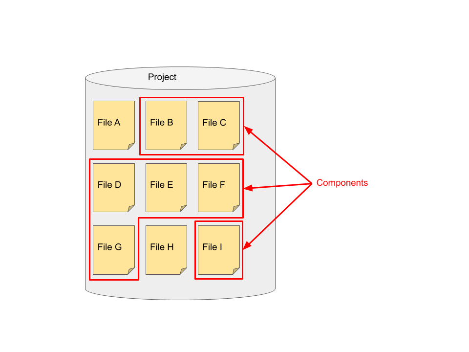
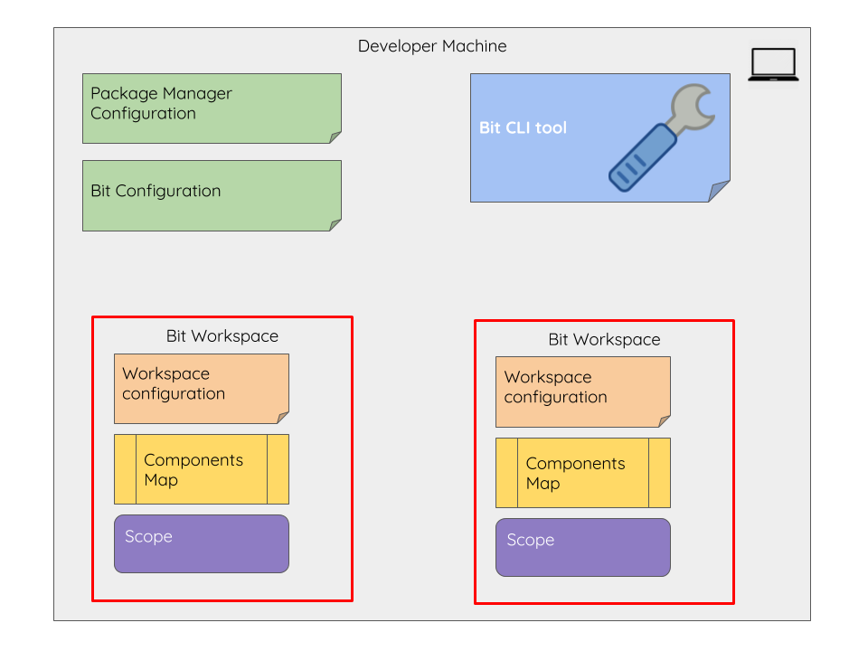
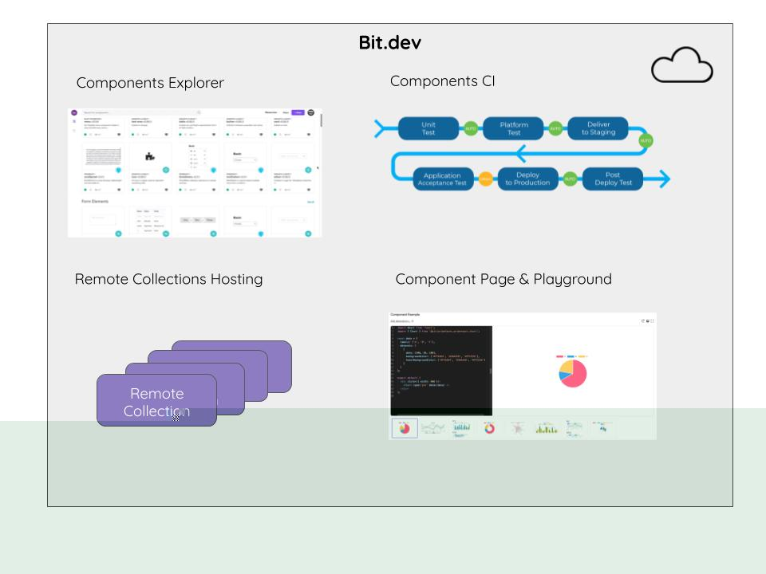

## Terminology

### Bit Component

A bit component is a logical unit with a defined and specific functionality that can be shared between different projects. A common example of shared components is the contents of UI libraries such as Bootstrap or Material UI  that share UI components that can be reused across multiple applications. Components may also be domain-specific such as shopping cart or login page.

Each bit component is defined as a set of files that contain the component’s code. The specific content of a bit component varies according to the specific framework. It may hold a single plain javascript file with a single function, React or Vue component or an Angular module. 
In addition to the files of the source code, bit retains information about the component semantics. This includes the source code, the dependencies the code has and the tools used for building and testing the component. 
This level of granularity enables developers to share the code of specific components and not just the files that compose them.

### Scope (Collection)

Bit stores components information in scopes. Just like a version control system is a collection of related files, a scope is s a collection of related components. 
Bit scopes are distributed by their nature. Similar to distributed version control systems (DVCS) such as git or mercurial, bit scopes are all made equal. That is to say that components can be exported and imported between any two scopes. However, just like a typical DVCS workflow, it is common to have a master scope which is used to share components between different machines.

Bit has two flavours of scopes: 

A **Workspace** is a scope that resides in a project where components are authored. Bit workspace can author, export, install, and import components. 

Any bit scope can work against multiple remote collections and export to and import from any of them.

## Bit Tools and Setup

### CLI Tool (bit-bin)

Bit CLI is an [open-source tool](https://github.com/teambit/bit). The Bit CLI tool is used in managing components in Bit scopes. The same tool can be installed on a development workspace and on a remote collection. 

A Bit development workspace and for managing components inside a workspace and between remote collections. All communications between bit scopes are done using the bit CLI commands. 
Bit CLI is installed on a development machine or on a Bit server and installed per machine and is storing its configuration in a bit configuration file. Bit CLI is also using configurations stored for git and npm. 

### NPM Configuration

NPM configuration is stored in an [.npmrc file](https://docs.npmjs.com/files/npmrc) that can be located in the project, per user or as a global configuration. 

Using NPM or Yarn to install components requires that the commands will be aware of the bit components' location. This is achieved by setting a pointer in the npm configuration to point to the bit registry for all installs that start with `@bit` and points to the bit registry located in `https://node.bit.dev`.
During Bit login via the CLI, a pointer is added to the user's configuration containing the bit registry and a the user token to access this registry. 

### Machine Configuration

Bit machine configuration contains information used by the Bit CLI to be able to access components remote server(s). The machine configuration applies to all workspaces on the machine.
The configuration file is created when running bit login, and is stored according to the OS. Bit configuration is managed using the `bit config` command.

## Bit Development Workstation

A development workstation has the following setup: 

- [bit-cli tool](#cli-tool-bit-bin)
- [NPM configuration](#npm-configuration)
- [Machine configuration](#machine-configuration)

Each development machine can have multiple Bit workspaces.

### Bit Workspace

A bit workspace is a bit scope that resides inside a project. Inside the workspace components are authored and it contains all the component information. Inside bit workspace, components can be authored, exported, imported, and installed.
The Bit workspace has 3 parts:

The **workspace config** contains information about the Bit components included in the project, such as the package manager used for installing it, the default compilers and testers, and the components code location. 

The workspace config is stored under the bit section in the `package.json`. You can also include it as a separate `bit.json` file at the workspace root.

The **components map** defines the files that comprise each component. This information is stored in the `.bitmap` file at the workspace root.

The **components scope** is the [scope](#scope) that contains the content of components. By default, the components store will be an extension to the git repository under `.git/bit` directory, but can be stored elsewhere, such as under a .bit folder.

## Bit Server

Bit can be setup as a server for for sharing components between development workstations. For organizations that do not want to upload code to the bit.dev cloud service, the option to work with an in-house server exists. 

Similar to workspace, a bit server requires the following setup: 

- [bit-cli tool](#cli-tool-bit-bin)
- [NPM configuration](#npm-configuration)
- [machine configuration](#machine-configuration)

Each bit server can have multiple remote collections defined. Each collection is a "bare" scope that is used for components sharing. Each scope is identified by the collection name.

The server is only used as a components storage and does not include the components’ CI and components’ explorer (see bellow). 

## bit.dev

Bit.dev server is a cloud service provided by Bit. Accessing bit.dev server requires registering a user account on the bit.dev server. To export and import components from a local workspace to the account, a login is required from the local workspace. 
Unlike Bit CLI tool that is open-sourced, Bit server is proprietary and owned by Bit. 

Bit.dev server provides these functions: 

### Remote Collections Hosting

A Remote Collection is a curated list of shared components on a remote server. The remote collection is used for collaborating on components between bit workspaces. Bit.dev provides hosting for remote collections for all the users.
Each remote collection contains the bit scope of its components as well as additional information on the collection: 

Collection name - The name by which the bit scope in the collection is available to developers for sharing or consuming components.  
Visibility - Determines who can view the Collection: A public collection is a free collection that is visible for all registered users. A private collection is limited to the organizations registered users. 
License - The default code license that is applicable for all the components shared in the collection (such as MIT, GPL or other licenses) 
Users & Roles - the users that have access to the collection and their roles on the collection (admin, developer or viewer).

### Component Playground

The component playground is a web-based editor and a rendering environment for each component that is hosted on Bit.dev server. 
The component playground enables developing example wrappers for the component to show its usage. 

### Component CI

When a component is exported to bit.dev, the components CI (Continuous Integration) will run a container for building and testing the component, according to the compiler and tester that you have defined for it. The component is built in an isolated environment that contains all the packages and dependencies of the component, validating that the component is truly stand-alone and can be consumed by other projects.  
The results of the run are displayed on the component page on bit.dev. 
Once the build and test tasks are finished, the remote container is purged. 
The component is then available in the component playground.

### Components Explorer

Bit.dev components explorer allows for a wide search across all the remote collections that the user can view such as the public collections and the user’s or organization's components. 
The component explorer is using metadata on the component such as tags, language, framework and size for advanced searching capabilities. 
