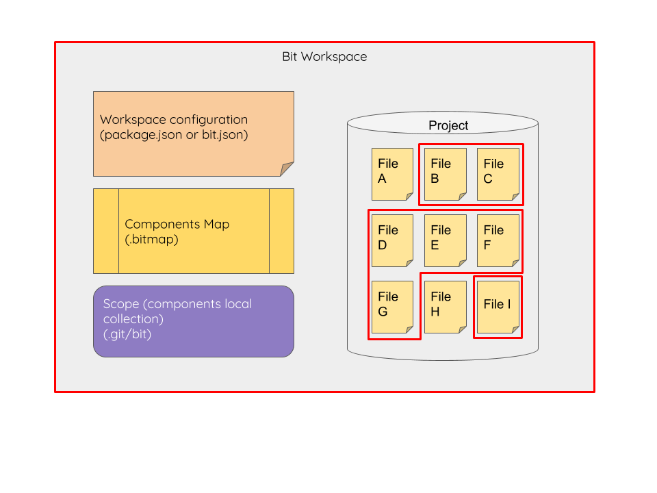

## Bit Component

A bit component is a logical unit with a defined and specific functionality that can be shared between different projects. A common example of shared components is the contents of UI libraries such as Bootstrap or Material UI that share UI components that can be reused across multiple applications. Components may also be domain-specific such as shopping cart or login page.  

Each bit component is defined as a set of files that contain the component’s code. The specific content of a bit component varies according to the specific framework. It may hold a single plain javascript file with a single function, React or Vue component or an Angular module.  
In addition to the files of the source code, bit retains information about the component semantics. This includes the source code, the dependencies the code has and the tools used for building and testing the component.  
This level of granularity enables developers to share components that can work in different projects, even if the structure of the receiving project is different from the original one.  

## Scope (Collection)

Bit stores components information in scopes. Just like a version control system is a collection of related files, a scope is s a collection of related components.  
Bit scopes are distributed by their nature. Similar to distributed version control systems (DVCS) such as git or mercurial, bit scopes are all made equal. That is to say that components can be exported and imported between any two scopes. However, just like a typical DVCS workflow, it is common to have a scope that is considered as the __master scope__ that centralizes the components from different working environments.  

## Bit Workspace

A bit workspace is a bit scope that resides inside a project. Inside the workspace components are authored and it contains all the component information. Inside bit workspace, components can be authored, exported, imported, and installed. Typically, each project will be a separate workspace.  

The Bit workspace has 3 parts:

- **workspace config** contains information about the Bit components included in the project, such as the package manager used for installing it, the default compilers and testers, and the components code location.  
The workspace config is stored under the bit section in the `package.json`. You can also include it as a separate `bit.json` file at the workspace root.  
This file is edited by the user to fit the exact configuration of the project.  
- **components map** defines the files that comprise each component. This information is stored in the `.bitmap` file at the workspace root. This file is auto-generated by Bit.  
- **components scope** is the [scope](#scope) that contains the content of components. By default, the components store will be an extension to the git repository under `.git/bit` directory, but can be stored elsewhere, such as under a .bit folder.

## Bit Server

Bit can be set up as a server for sharing components between local workspaces. Each Bit server may host multiple scope which are referenced as **remote collections**. Each remote collection is a **bare scope** that only stores the components information. Components cannot be authored and tracked inside a bare scope.  
Components from a project's workspace can be exported to remote collections hosted on a Bit server. A project's workspace can export to multiple remote collections that are stored on a single Bit server, or on several Bit servers.
Managing Bit server remote collection requires that the server will have [bit CLI](#cli-tool-bit-bin) installed, as well as  Bit CLI configuration and npm configuration.  

## Bit CLI  (bit-bin)

Working with a bit workspace on local dev machine or setting up a bit server requires the Bit CLI tool. Bit CLI manages the components and scopes and their content.  
Bit CLI is an [open-source tool](https://github.com/teambit/bit). Bit CLI tool is installed both on a project's workspace and on a Bit server for managing remote collections.  
All components and scopes management is done using the bit CLI tool, installed(//ToDo) on a specific machine.  
The CLI tool is using a configuration that is shared between all workspaces on a single machine. Bit CLI configuration is accessible using the [`bit config`](apis/cli#config) command. The configuration file is created when running `bit login`, and is stored according to the OS.

## NPM Configuration

Using NPM or Yarn to install components requires that the commands will be aware of the bit components' location. This is achieved by setting a pointer in the npm configuration to point to the bit registry for all installs that start with `@bit` and points to the bit registry located in `https://node.bit.dev`.
During Bit login via the CLI, a pointer is added to the user's configuration containing the bit registry and the user token to access this registry.  
NPM configuration is stored in an [.npmrc file](https://docs.npmjs.com/files/npmrc) that can be located in the project, per-user or as a global configuration.

## bit.dev

[Bit.dev server](docs/bit.dev) is a cloud service provided by Bit. Accessing bit.dev server requires registering a user account on the bit.dev server. To export and import components from a local workspace to the account, a login is required from the local workspace.  

Read more about [bit.dev capabilities](bit.dev-cloud)  
Unlike Bit CLI tool that is open-sourced, Bit server is proprietary and owned by Bit.
